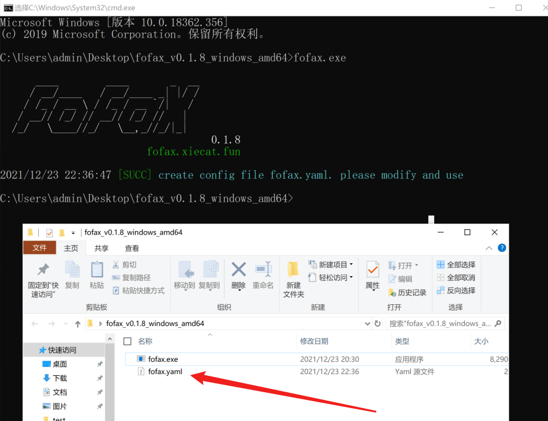
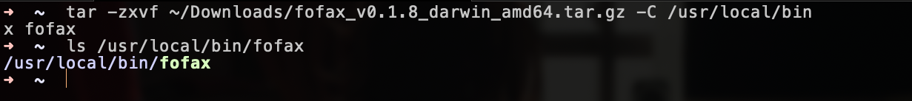
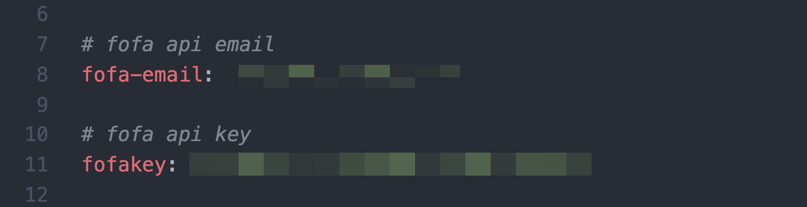

# fofaX

[](https://github.com/xiecat/fofax/releases/latest)[](https://github.com/xiecat/fofax/issues)

## 0x00 简介

fofax是一款使用go编写的命令行fofa查询工具，定位于命令行，特点是简单并快速。目前已拥有基本语法查询、icon hash计算查询以及证书计算查询等等，除此之外还有我们定义的fx语法查询，用户可以通过yaml格式的配置文件编写自己的特定fx查询规则。

## 0x01 下载

点击 [Releases下载链接](https://github.com/xiecat/fofax/releases) ，按照自己的系统来选择相应的发行版本。

## 0x02 配置

### Windows

解压压缩包，第一次运行 `fofax.exe` 会在同级目录下生成一个 `fofax.yaml` 的配置文件。



然后打开此配置文件，并填写 `email` 和 `key`。

### macOS/Linux

将下载下来的fofax压缩包解压，并建议放在 `/usr/local/bin/` 目录下，这样的目的是在任何一个目录都可以运行 `fofax` 命令。

```bash
tar -zxvf ~/Downloads/fofax_v0.1.8_darwin_amd64.tar.gz -C /usr/local/bin/
```



第一次运行 `fofax` 命令会自动生成一个配置文件，位于 `~/.config/fofax/fofax.yaml`。

```bash
➜  ~  fofax

      ____        ____       _  __
     / __/____   / __/____ _| |/ /
    / /_ / __ \ / /_ / __ `/|   /
   / __// /_/ // __// /_/ //   |
  /_/   \____//_/   \__,_//_/|_|
                                    0.1.8
                         fofax.xiecat.fun

2021/12/23 21:21:28 [SUCC] create config file /Users/user/.config/fofax/fofax.yaml. please modify and use
```

接下来就是对此配置文件进行配置了，一般来说只需要配置完 `email` 和 `key` 就可以了。

```bash
vim ~/.config/fofax/fofax.yaml
```



## 0x03 使用

### 使用Tips

不带任何参数时，除了会输出ASCII Logo，还会随机输出一条使用Tips。

```bash
➜  ~  fofax

      ____        ____       _  __
     / __/____   / __/____ _| |/ /
    / /_ / __ \ / /_ / __ `/|   /
   / __// /_/ // __// /_/ //   |
  /_/   \____//_/   \__,_//_/|_|
                                    0.1.8
                         fofax.xiecat.fun

fofaX is a command line fofa query tool, simple is the best!

Tips:
Comment: 搜索 fx 中 google-reverse, 查询时使用扩展功能必须加 -fe 参数
Usage: fofax -q 'fx="google-reverse"' -fe
```

### 帮助信息

可以使用 `fofax -h` 显示帮助信息。

```bash
➜  ~  fofax -h

      ____        ____       _  __
     / __/____   / __/____ _| |/ /
    / /_ / __ \ / /_ / __ `/|   /
   / __// /_/ // __// /_/ //   |
  /_/   \____//_/   \__,_//_/|_|
                                    0.1.8
                         fofax.xiecat.fun

fofaX is a command line fofa query tool, simple is the best!

Usage:
  fofax [flags]

Flags:
CONFIGS:
   -email, -fofa-email string  Fofa API Email
   -key, -fofakey string       Fofa API Key
   -p, -proxy string           proxy for http like http://127.0.0.1:8080
   -fofa-url string            Fofa url (default "https://fofa.so")
   -debug                      Debug mode

FILTERS:
   -fs, -fetch-size int          The maximum number of query (default 100)
   -e, -exclude                  Exclude the honeypot.
   -ec, -exclude-country-cn      Exclude CN.
   -ffi, -fetch-fullHost-info    URL fetch, with scheme, hostname, port
   -fto, -fetch-titles-ofDomain  Fetch website title

SINGLE QUERY/ERT/ICON:
   -q, -query string              FoFa query statement
   -uc, -url-cert string          Enter the certificate of the https URL to query
   -iu, -url-to-icon-hash string  Enter the URL of an icon, calculate it and query it
   -if, -icon-file-path string    Calculate the hash of the local icon file, then query it

MULTIPLE QUERY/CERT/ICON:
   -qf, -query-file string           Load files, query multiple statements
   -ucf, -url-cert-file string       Read the URL from the file, calculate the cert and then query it
   -iuf, -icon-hash-url-file string  Retrieve the URL from the file, calculate the icon hash and query it

FX GRAMMER:
   -g, -gen string           Generate fx statement files eg: default_fx.yaml
   -fd, -fxdir string        fxdir directory (default "/Users/user/.config/fofax/fxrules")
   -l, -lists                List of fx statements
   -lt, -list-tags           List fx tags
   -s, -search string        Search for fx statements. Statements are separated by semicolons eg: id=fx-2021-01;query="jupyter Unauth"
   -tree                     Print syntax tree
   -fe, -fofa-ext            Using extended syntax(fx)
   -ss, -show-single string  Display a single fx message

OTHER OPTIONS:
   -config string  fofax configuration file.The file reading order(fofax.yaml,/Users/user/.config/fofax/fofax.yaml,/etc/fofa.yaml) (default "/Users/user/.config/fofax/fofax.yaml")
   -v, -version    Show fofaX version
   -use            Syntax queries
   -open           Open with your browser only support pipline/-q/-uc/-iu/-if
   -no-limit-open  No limit to the number of openings in your browser
```

### FOFA语法规则

使用 `-use` 参数，显示FOFA语法查询规则。

```bash
➜  ~  fofax -use

      ____        ____       _  __
     / __/____   / __/____ _| |/ /
    / /_ / __ \ / /_ / __ `/|   /
   / __// /_/ // __// /_/ //   |
  /_/   \____//_/   \__,_//_/|_|
                                    0.1.8
                         fofax.xiecat.fun

┌───────────────────────────────────────────┬──────────────────────────────────────────────────┐
│ Query                                     │ Explanation                                      │
├───────────────────────────────────────────┼──────────────────────────────────────────────────┤
│ title="beijing"                           │ 从标题中搜索"北京"                               	  │
│ header="elastic"                          │ 从http头中搜索"elastic"                          	 │
│ body="网络空间测绘"                       	 │ 从html正文中搜索"网络空间测绘"                   	  │
│ title="beijing"                           │ 从标题中搜索"北京"                              	  │
│ header="elastic"                          │ 从http头中搜索"elastic"                          	 │
│ body="网络空间测绘"                       	 │ 从html正文中搜索"网络空间测绘"                   	   │
│ fid="kIlUsGZ8pT6AtgKSKD63iw=="            │ 查找相同的网站指纹                               	   │
│ domain="google.com"                       │ 搜索根域名带有google.com的网站                   		│
│ icp="京ICP证030173号"                     	│ 查找备案号为"京ICP证030173号"的网站              	 │
│ js_name="js/jquery.js"                    │ 查找网站正文中包含js/jquery.js的资产             		│
│ js_md5="82ac3f14327a8b7ba49baa208d4eaa15" │ 查找js源码与之匹配的资产                         		│
└───────────────────────────────────────────┴──────────────────────────────────────────────────┘
```

### 基础查询

有如下两种方式查询 `app="APACHE-Solr"`，不指定数量默认会输出100个host，并且默认会对数据进行去重。

```bash
➜  ~  fofax -q 'app="APACHE-Solr"'

      ____        ____       _  __
     / __/____   / __/____ _| |/ /
    / /_ / __ \ / /_ / __ `/|   /
   / __// /_/ // __// /_/ //   |
  /_/   \____//_/   \__,_//_/|_|
                                    0.1.8
                         fofax.xiecat.fun

2021/12/23 20:17:32 [SUCC] Fetch Data From FoFa: [100/30830]
54.114.20.168:8443
193.8.4.43:8983
208.37.227.95:8983
3.20.255.140:8983
3.114.85.178:8983
82.142.82.197:8983
159.39.10.212:8983
199.102.27.69:8983
178.170.42.179:8443
52.29.111.136:8983
184.73.40.143:8443
20.203.127.70:443
68.16.117.45:8983
213.119.204.110:8983
3.134.71.179:8983
185.11.18.223:8983
122.13.165.216:8983
208.97.27.80:8983
…………
```

```bash
➜  ~  echo 'app="APACHE-Solr"' | fofax
2021/12/23 20:17:59 [SUCC] Fetch Data From FoFa: [100/30830]
54.114.20.168:8443
193.8.4.43:8983
208.37.227.95:8983
3.20.255.140:8983
3.114.85.178:8983
82.142.82.197:8983
159.39.10.212:8983
199.102.27.69:8983
178.170.42.179:8443
52.29.111.136:8983
184.73.40.143:8443
20.203.127.70:443
68.16.117.45:8983
213.119.204.110:8983
3.134.71.179:8983
185.11.18.223:8983
122.13.165.216:8983
208.97.27.80:8983
…………
```

### 指定查询数量

```bash
➜  ~  echo 'app="APACHE-Solr"' | fofax -fs 5
2021/12/23 20:19:00 [SUCC] Fetch Data From FoFa: [5/30830]
13.57.71.190:8443
165.22.215.32:8983
184.73.40.143:8443
3.20.255.140:8983
```

如上只输出了4条数据，是因为fofax自动对重复的数据进行了去重（不信可以看fofa API的返回数据）。


### 排除查询

添加 `-e` 参数，排除蜜罐的干扰。

```bash
➜  ~  echo 'app="APACHE-Solr"' | fofax -fs 10 -e                                           system: ruby 2.6.3p62
2021/12/23 22:56:14 [SUCC] Fetch Data From FoFa: [10/30849]
13.126.128.253:80
185.22.235.14:8983
151.248.126.4:8983
20.71.77.183:80
23.102.46.20:443
15.113.170.101:8443
52.58.201.109:80
```

添加 `-ec` 参数，排除中国的数据。

```bash
➜  ~  echo 'app="APACHE-Solr"' | fofax -fs 10 -ec                                            system: ruby 2.6.3p62
2021/12/23 22:56:36 [SUCC] Fetch Data From FoFa: [10/26044]
15.113.170.101:8443
52.58.201.109:80
13.126.128.253:80
185.22.235.14:8983
151.248.126.4:8983
20.71.77.183:80
23.102.46.20:443
```

### 获取URL

添加 `-ffi` 参数，根据查询语句直接获取对应的URL（[scheme]://[host]:[port]）。

```bash
➜  ~  echo 'app="APACHE-Solr"' | fofax -fs 5
2021/12/23 20:21:03 [SUCC] Fetch Data From FoFa: [5/30830]
https://184.73.40.143:8443
http://120.24.42.244:8983
https://13.57.71.190:8443
http://165.22.215.32:8983
```

### 获取Title

```bash
➜  ~  echo 'domain="baidu.com" && status_code="200"' | fofax -fs 10 -fto
2021/12/23 20:21:19 [SUCC] Fetch Data From FoFa: [10/1124]
https://home.baidu.com [关于百度]
http://research.baidu.com [Baidu Research]
http://fecs.baidu.com [FECS - Front End Code Style Suite]
http://yuntu.baidu.com [企业图谱]
https://ditu.baidu.com [百度地图]
https://sp2.baidu.com [百度一下，你就知道]
https://tushuo.baidu.com [图说]
https://ocpc.baidu.com [百度 oCPC 开发者中心]
https://naotu.baidu.com [百度脑图 - 便捷的思维工具]
http://usa.baidu.com [Baidu USA]
```

### Debug模式

添加 `-debug` 参数，开启Debug详细模式。

```bash
echo 'app="APACHE-Solr"' | fofax -fs 5 -ffi -debug
```


### 浏览器中打开

```bash
echo 'app="APACHE-Solr"' | fofax -open
```


### 计算icon hash并查询

两种方式，第一种是直接根据提供icon的URL来查询。

```bash
➜  ~  fofax -iu https://www.baidu.com/favicon.ico -fs 5

      ____        ____       _  __
     / __/____   / __/____ _| |/ /
    / /_ / __ \ / /_ / __ `/|   /
   / __// /_/ // __// /_/ //   |
  /_/   \____//_/   \__,_//_/|_|
                                    0.1.8
                         fofax.xiecat.fun

2021/12/23 20:21:59 [SUCC] Fetch Data From FoFa: [5/13284]
47.98.104.77:8088
154.39.217.22:80
xueshu.mrsb.tk:80
154.39.217.2:80
154.39.217.28:80
```

第二种是根据本地icon文件，来计算hash并查询。

```bash
➜  ~  wget https://www.baidu.com/favicon.ico
➜  ~  fofax -if favicon.ico -fs 5

      ____        ____       _  __
     / __/____   / __/____ _| |/ /
    / /_ / __ \ / /_ / __ `/|   /
   / __// /_/ // __// /_/ //   |
  /_/   \____//_/   \__,_//_/|_|
                                    0.1.8
                         fofax.xiecat.fun

2021/12/23 21:25:24 [SUCC] Fetch Data From FoFa: [5/13284]
47.98.104.77:8088
154.39.217.22:80
xueshu.mrsb.tk:80
154.39.217.2:80
154.39.217.28:80
```

### 计算证书并查询

```bash
➜  ~  fofax -fs 5 -uc https://www.baidu.com/

      ____        ____       _  __
     / __/____   / __/____ _| |/ /
    / /_ / __ \ / /_ / __ `/|   /
   / __// /_/ // __// /_/ //   |
  /_/   \____//_/   \__,_//_/|_|
                                    0.1.8
                         fofax.xiecat.fun

2021/12/23 21:29:54 [SUCC] Fetch Data From FoFa: [5/361619]
180.97.93.146:443
180.97.93.65:443
112.3.25.49:443
itv.leiqiang8.cn:80
owa2.leiqiang8.cn:80
```

### fx语法查询

显示内置fx查询语句。

```bash
➜  ~  fofax -l

      ____        ____       _  __
     / __/____   / __/____ _| |/ /
    / /_ / __ \ / /_ / __ `/|   /
   / __// /_/ // __// /_/ //   |
  /_/   \____//_/   \__,_//_/|_|
                                    0.1.8
                         fofax.xiecat.fun

┌───────────────┬────────────────────────────────┬────────────────────────────────┬────────┬─────────────┬────────┐
│ Id            │ Query                          │ RuleName                       │ Author │ Tag         │ Type   │
├───────────────┼────────────────────────────────┼────────────────────────────────┼────────┼─────────────┼────────┤
│ fx-2021-1001  │ google-reverse                 │ Google反代服务器               │ fofa   │ google      │ 内置   │
│ fx-2021-1002  │ python-simplehttp              │ Python SimpleHTTP              │ fofa   │ python      │ 内置   │
│ fx-2021-1003  │ data-leak                      │ 社工库                         │ fofa   │ fun         │ 内置   │
│ fx-2021-1004  │ hfs-rce                        │ 存在命令执行的HFS服务          │ fofa   │ fun         │ 内置   │
│ fx-2021-1005  │ satellite-ftp                  │ 一键日卫星FTP？                │ fofa   │ fun         │ 内置   │
│ fx-2021-1006  │ mk-mining                      │ mk路由器全球挖矿感染           │ fofa   │ fun         │ 内置   │
│ fx-2021-1007  │ ss-manager-login               │ ss-Manager 登录                │ fofa   │ fun         │ 内置   │
│ fx-2021-1008  │ heating-monitor                │ 供暖监控系统                   │ fofa   │ fun         │ 内置   │
│ fx-2021-1009  │ free-proxy                     │ 免费代理池                     │ fofa   │ fun         │ 内置   │
│ fx-2021-1010  │ honeypot                       │ 蜜罐                           │ fofa   │ fun         │ 内置   │
│ fx-2021-1011  │ hacked-website                 │ 被挂黑的站点                   │ fofa   │ fun         │ 内置   │
│ fx-2021-1012  │ jupyter-unauth                 │ Jupyter 未授权                 │ xiecat │ unauth      │ 内置   │
│ fx-2021-11001 │ APACHE-ActiveMQ                │ APACHE ActiveMQ                │ fofa   │ log4j2,fofa │ 内置   │
│ fx-2021-11002 │ Apache_OFBiz                   │ Apache OFBiz                   │ fofa   │ log4j2,fofa │ 内置   │
│ fx-2021-11003 │ Jenkins                        │ Jenkins                        │ fofa   │ log4j2,fofa │ 内置   │
│ fx-2021-11004 │ RabbitMQ                       │ RabbitMQ                       │ fofa   │ log4j2,fofa │ 内置   │
│ fx-2021-11005 │ Apache-log4j2-Web              │ Apache log4j2 Web              │ fofa   │ log4j2,fofa │ 内置   │
│ fx-2021-11006 │ Jedis                          │ Jedis                          │ fofa   │ log4j2,fofa │ 内置   │
│ fx-2021-11007 │ APACHE-tika                    │ APACHE tika                    │ fofa   │ log4j2,fofa │ 内置   │
│ fx-2021-11009 │ 致远互联-FE                     │ 致远互联 FE                    │ fofa   │ log4j2,fofa │ 内置   │
└───────────────┴────────────────────────────────┴────────────────────────────────┴────────┴─────────────┴────────┘
```

列出fx语句的详细内容。

```bash
➜  ~  fofax -ss fx-2021-1001

      ____        ____       _  __
     / __/____   / __/____ _| |/ /
    / /_ / __ \ / /_ / __ `/|   /
   / __// /_/ // __// /_/ //   |
  /_/   \____//_/   \__,_//_/|_|
                                    0.1.8
                         fofax.xiecat.fun

fx-2021-1001 fx-2021-1001
┌─────────────┬─────────────────────────────────────────────────────────────────────────────────────────────┐
│ Name        │ Value                                                                                       │
├─────────────┼─────────────────────────────────────────────────────────────────────────────────────────────┤
│ ID          │ fx-2021-1001                                                                                │
│ Query       │ google-reverse                                                                              │
│ RuleName    │ Google反代服务器                                                                            │
│ RuleEnglish │ Google Reverse proxy                                                                        │
│ Author      │ fofa                                                                                        │
│ FofaQuery   │ body="var c = Array.prototype.slice.call(arguments, 1);return function() {var d=c.slice();" │
│ Tag         │ google                                                                                      │
│ Type        │ 内置                                                                                        │
│ Description │ 不用挂代理就可以访问的Google搜索，但搜索记录可能会被记录。                                  │
│ FileDir     │                                                                                             │
└─────────────┴─────────────────────────────────────────────────────────────────────────────────────────────┘
```

通过fx语法进行查询，一定要有 `-fe`参数。

```bash
[~] fofax -q 'fx="google-reverse"' -fe -fs 5

      ____        ____       _  __
     / __/____   / __/____ _| |/ /
    / /_ / __ \ / /_ / __ `/|   /
   / __// /_/ // __// /_/ //   |
  /_/   \____//_/   \__,_//_/|_|
                                    0.1.8
                         fofax.xiecat.fun

2021/12/23 22:27:02 [SUCC] fx query id:google-reverse
2021/12/23 22:27:03 [SUCC] Fetch Data From FoFa: [5/5834]
54.76.26.205:10000
47.74.3.55:80
47.90.7.161:443
23.83.249.79:443
45.76.10.197:8081
```

通过fx语法进行查询，并在浏览器中直接打开。

```bash
➜  ~  fofax -q 'fx="google-reverse"' -fe -open

      ____        ____       _  __
     / __/____   / __/____ _| |/ /
    / /_ / __ \ / /_ / __ `/|   /
   / __// /_/ // __// /_/ //   |
  /_/   \____//_/   \__,_//_/|_|
                                    0.1.8
                         fofax.xiecat.fun

2021/12/23 22:22:21 [SUCC] fx query id:google-reverse
2021/12/23 22:22:21 [SUCC] the query body="var c = Array.prototype.slice.call(arguments, 1);return function() {var d=c.slice();" will be opened with a browser
```

可以通过编写yaml格式的配置文件自定义fx语法规则。


## 0x04 联动使用案例

### fofax && httpx

CVE-2021-43798 Grafana未授权目录遍历。


### fofax && nuclei

将fofax获取的数据传递到nuclei，然后使用CVE-2021-43798 Template批量漏洞扫描。


