# fofaX

[](https://github.com/xiecat/fofax/releases/latest)[](https://github.com/xiecat/fofax/issues)

## 0x00 简介

fofaX是一款命令行fofa查询工具，定位命令行，简单就是最好的！

## 0x01 下载

点击 [Releases下载链接](https://github.com/xiecat/fofax/releases) ，按照自己的系统来选择相应的发行版本。

## 0x02 配置

### Windows


### macOS/Linux


## 0x03 使用

### 使用Tips

不带任何参数时，除了会输出ASCII Logo，还会随机输出一条使用Tips。

```bash
fofax
```

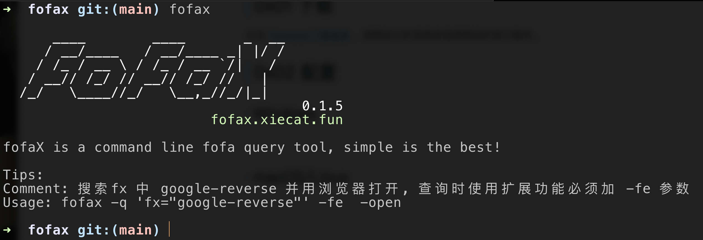


### 帮助信息

可以使用 `fofax -h` 显示帮助信息。

```bash
fofax -h
```

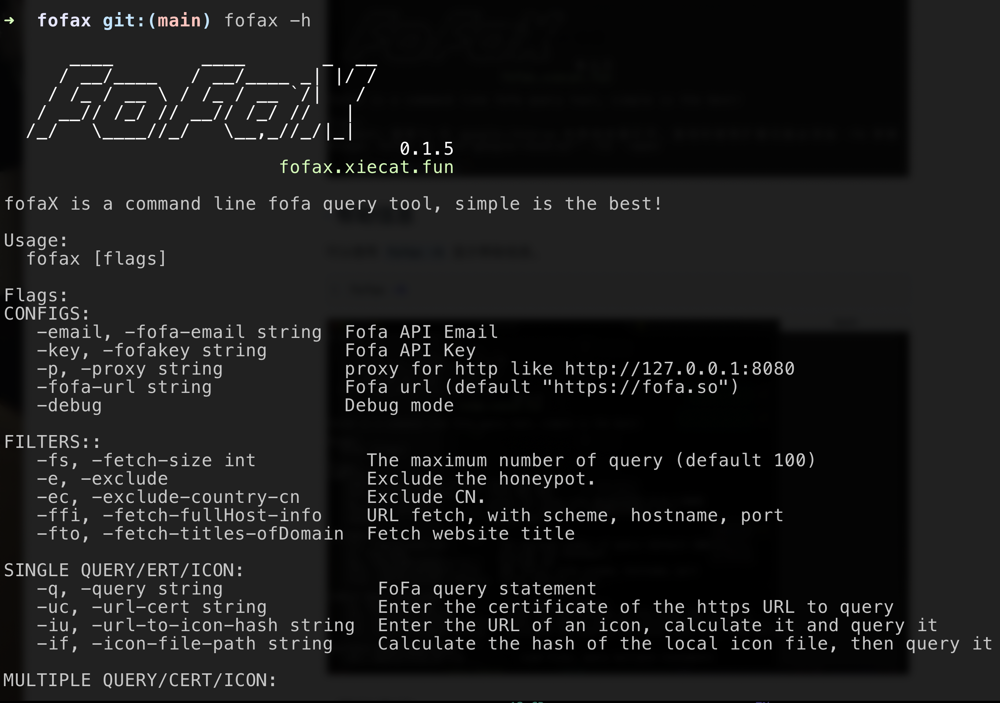

### FOFA语法规则

使用 `-use` 参数，显示FOFA语法查询规则。

```bash
fofax -use
```

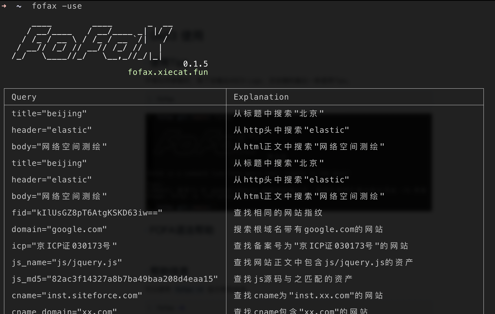

### 基础查询

有如下两种方式查询 `app="APACHE-Solr"`，不指定数量默认会输出100个host，并且默认会对数据进行去重。

```bash
fofax -q 'app="APACHE-Solr"'
```

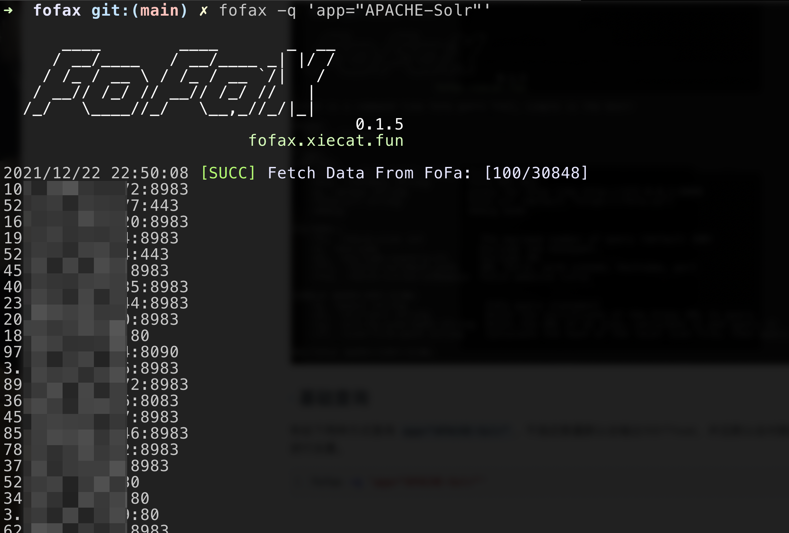

```bash
echo 'app="APACHE-Solr"' | fofax
```

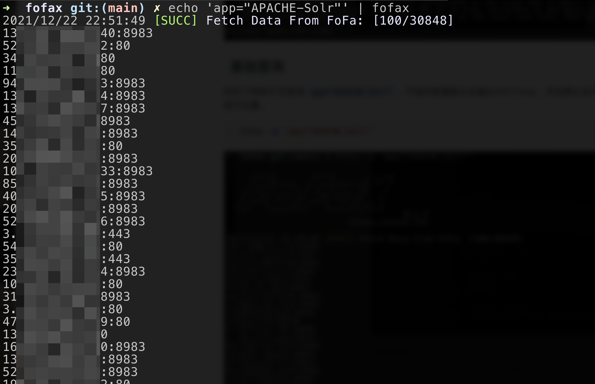

### 指定查询数量

```bash
echo 'app="APACHE-Solr"' | fofax -fs 5
```

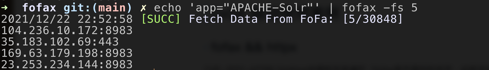

如上只输出了4条数据，是因为fofax自动对重复的数据进行了去重（不信可以看fofa API的返回数据）。

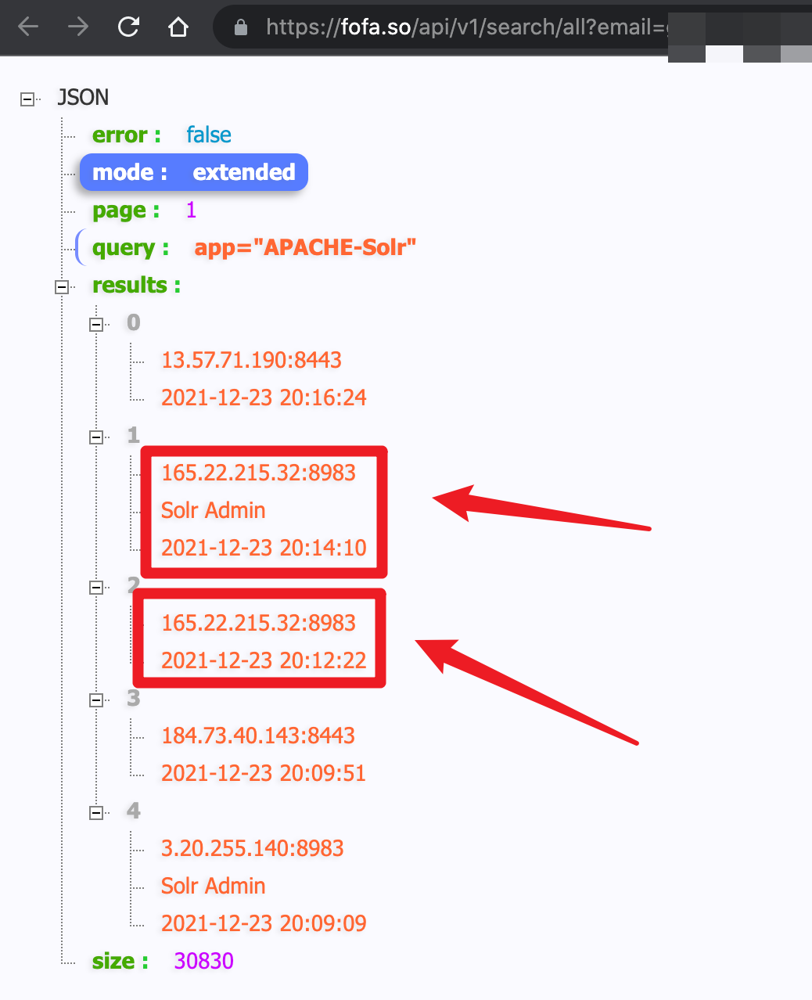

### 获取URL

添加 `-ffi` 参数，根据查询语句直接获取对应的URL（[scheme]://[host]:[port]）。

```bash
echo 'app="APACHE-Solr"' | fofax -fs 5 -ffi
```

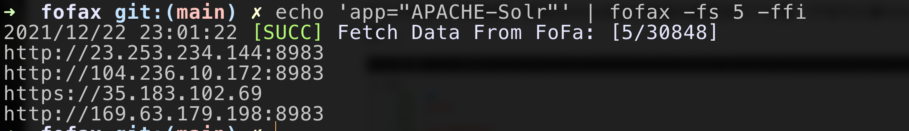

### Debug模式

添加 `-debug` 参数，开启Debug详细模式。

```bash
echo 'app="APACHE-Solr"' | fofax -fs 5 -ffi -debug
```

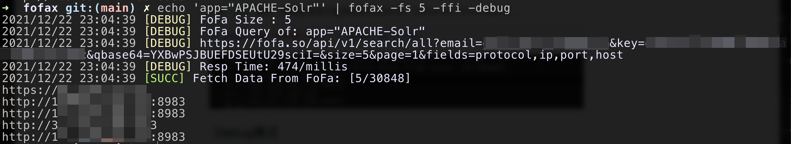

### 浏览器中打开

```bash
echo 'app="APACHE-Solr"' | fofax -open
```


### icon hash查询

两种方式，第一种是直接根据提供icon的URL来查询。

```bash
fofax -iu https://www.baidu.com/favicon.ico -fs 5
```

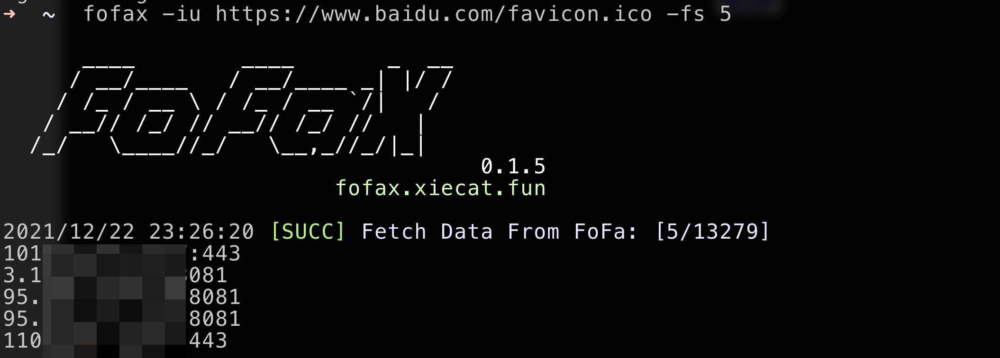

第二种是根据本地icon文件，来计算hash并查询。

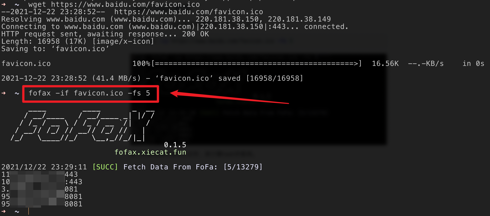


## 0x04 联动使用案例

### fofax && httpx

CVE-2021-43798 Grafana未授权目录遍历。


### fofax && nuclei
