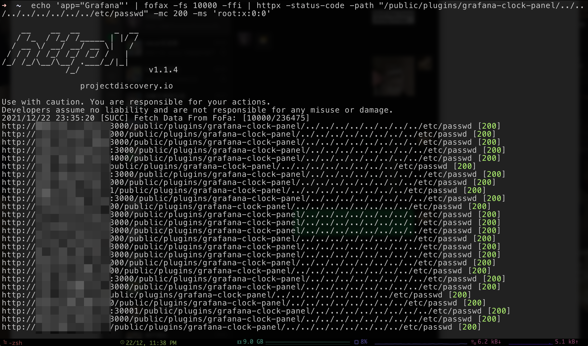
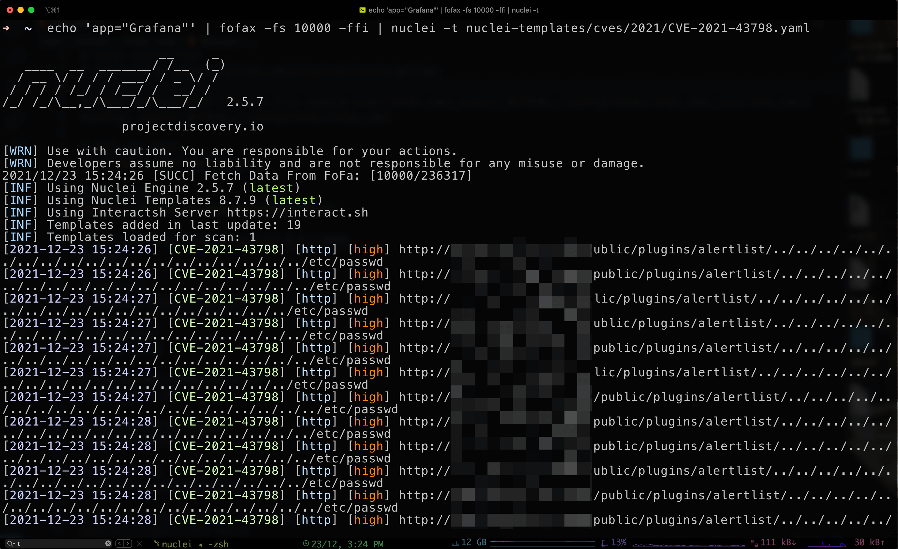

# FoFaX

[](https://github.com/xiecat/fofax/releases/latest)[](https://github.com/xiecat/fofax/issues)

[:ledger: English README](https://github.com/xiecat/fofax/blob/main/README.md)   |   [:pushpin: Releases Download](https://github.com/xiecat/fofax/releases) [:racehorse: 详细使用文档 Docs](http://fofax.xiecat.fun/)

## 0x00 简介

FoFaX 是一款使用 Go 编写的命令行 FoFa 查询工具，在支持 FoFa 查询规则上增加了 Fx 语法来方便使用者编写自己的规则，并且内置了一些常用的规则，除此之外还有联动其他安全产品在内的其他多个实用功能。主要的功能如下：

- 基本 FoFa 语法查询
- 联动其他安全工具
- 内置大量 FoFa 规则
- Icon Hash 本地/在线计算查询
- URL 证书计算查询
- 排除国内资产
- 一键浏览器中打开
- 更多（等待您使用后的反馈）……

除此之外还可以自定义 Fx 语法查询，用户可以通过 yaml 格式的配置文件编写自己的特定 Fx 查询规则。

## 0x01 下载

点击 [Releases下载链接](https://github.com/xiecat/fofax/releases) ，按照自己的系统架构选择相应的发行版本下载。

## 0x02 配置

### MacOS/Linux

将下载下来的 FoFaX 压缩包解压，建议放在 `/usr/local/bin/` 目录下，以达到任意目录都可以运行 FoFaX 命令的目的。

```console
tar -zxvf ~/Downloads/fofax_v0.1.22_darwin_amd64.tar.gz -C /usr/local/bin/
```

第一次运行 FoFaX 命令会自动生成一个配置文件，位于 `~/.config/fofax/fofax.yaml`。

```console
fofax

      ____        ____       _  __
     / __/____   / __/____ _| |/ /
    / /_ / __ \ / /_ / __ `/|   /
   / __// /_/ // __// /_/ //   |
  /_/   \____//_/   \__,_//_/|_|

                         fofax.xiecat.fun

2021/12/23 21:21:28 [SUCC] create config file /Users/user/.config/fofax/fofax.yaml. please modify and use
```

接下来就是对此配置文件进行配置了，一般来说只需要配置完 `email` 和 `key` 就可以了。

```console
vim ~/.config/fofax/fofax.yaml
```

```console
# fofa api email
fofa-email: ******@gmail.com

# fofa api key
fofakey: ***************
```

### Windows

解压压缩包，第一次运行 fofax.exe 会在同级目录下生成一个 fofax.yaml 的配置文件。然后打开此配置文件，并填写 `email` 和 `key`。

## 0x03 使用方法

### 使用 Tips

不带任何参数时，除了会输出 ASCII Logo，还会随机输出一条使用 Tips。

```console
fofax

      ____        ____       _  __
     / __/____   / __/____ _| |/ /
    / /_ / __ \ / /_ / __ `/|   /
   / __// /_/ // __// /_/ //   |
  /_/   \____//_/   \__,_//_/|_|

                         fofax.xiecat.fun

fofaX is a command line fofa query tool, simple is the best!

Tips:
Comment: 搜索 Fx 中 google-reverse, 查询时使用扩展功能必须加 -fe 参数
Usage: fofax -q 'fx="google-reverse"' -fe
```

### 帮助信息

可以使用 `fofax -h` 显示帮助信息。

```console
fofax -h

fofaX is a command line fofa query tool, simple is the best!

Usage:
  fofax [flags]

Flags:
CONFIGS:
   -email, -fofa-email string  Fofa API Email
   -key, -fofakey string       Fofa API Key
   -p, -proxy string           proxy for http like http://127.0.0.1:8080
   -fofa-url string            Fofa url (default "https://fofa.so")
   -debug                      Debug mode

FILTERS:
   -fs, -fetch-size int          The maximum number of query (default 100)
   -e, -exclude                  Exclude the honeypot.
   -ec, -exclude-country-cn      Exclude CN.
   -ffi, -fetch-fullHost-info    URL fetch, with scheme, hostname, port
   -fto, -fetch-titles-ofDomain  Fetch website title

SINGLE QUERY/ERT/ICON:
   -q, -query string              FoFa query statement
   -uc, -url-cert string          Enter the certificate of the https URL to query
   -iu, -url-to-icon-hash string  Enter the URL of an icon, calculate it and query it
   -if, -icon-file-path string    Calculate the hash of the local icon file, then query it

MULTIPLE QUERY/CERT/ICON:
   -qf, -query-file string           Load files, query multiple statements
   -ucf, -url-cert-file string       Read the URL from the file, calculate the cert and then query it
   -iuf, -icon-hash-url-file string  Retrieve the URL from the file, calculate the icon hash and query it

FX GRAMMER:
   -g, -gen string           Generate fx statement files eg: default_fx.yaml
   -fd, -fxdir string        fxdir directory (default "/Users/user/.config/fofax/fxrules")
   -l, -lists                List of fx statements
   -lt, -list-tags           List fx tags
   -s, -search string        Search for fx statements. Statements are separated by semicolons eg: id=fx-2021-01;query="jupyter Unauth"
   -tree                     Print syntax tree
   -fe, -fofa-ext            Using extended syntax(fx)
   -ss, -show-single string  Display a single fx message

OTHER OPTIONS:
   -config string  fofax configuration file.The file reading order(fofax.yaml,/Users/user/.config/fofax/fofax.yaml,/etc/fofa.yaml) (default "/Users/user/.config/fofax/fofax.yaml")
   -v, -version    Show fofaX version
   -use            Syntax queries
   -open           Open with your browser only support pipline/-q/-uc/-iu/-if
   -no-limit-open  No limit to the number of openings in your browser
```

### FoFa 语法规则

使用 `-use` 参数，显示 FoFa 语法查询规则。

```console
fofax -use

┌───────────────────────────────────────────┬──────────────────────────────────────────────────┐
│ Query                                     │ Explanation                                      │
├───────────────────────────────────────────┼──────────────────────────────────────────────────┤
│ title="beijing"                           │ 从标题中搜索"北京"                                     │
│ header="elastic"                          │ 从http头中搜索"elastic"                               │
│ body="网络空间测绘"                         │ 从html正文中搜索"网络空间测绘"                       │
│ title="beijing"                           │ 从标题中搜索"北京"                                    │
│ header="elastic"                          │ 从http头中搜索"elastic"                            │
│ body="网络空间测绘"                         │ 从html正文中搜索"网络空间测绘"                       │
│ fid="kIlUsGZ8pT6AtgKSKD63iw=="            │ 查找相同的网站指纹                                     │
│ domain="google.com"                       │ 搜索根域名带有google.com的网站                         │
│ icp="京ICP证030173号"                      │ 查找备案号为"京ICP证030173号"的网站                  │
│ js_name="js/jquery.js"                    │ 查找网站正文中包含js/jquery.js的资产                    │
│ js_md5="82ac3f14327a8b7ba49baa208d4eaa15" │ 查找js源码与之匹配的资产                                │
└───────────────────────────────────────────┴──────────────────────────────────────────────────┘
```

### 基础查询

有如下两种方式查询 `app="APACHE-Solr"`，不指定数量默认会输出 100 个 host，并且默认会对数据进行去重。

```console
fofax -q 'app="APACHE-Solr"'

2021/12/23 20:17:32 [SUCC] Fetch Data From FoFa: [100/30830]
54.114.20.168:8443
193.8.4.43:8983
208.37.227.95:8983
3.20.255.140:8983
3.114.85.178:8983
82.142.82.197:8983
159.39.10.212:8983
199.102.27.69:8983
…………
```

```console
echo 'app="APACHE-Solr"' | fofax
2021/12/23 20:17:59 [SUCC] Fetch Data From FoFa: [100/30830]
54.114.20.168:8443
193.8.4.43:8983
208.37.227.95:8983
3.20.255.140:8983
3.114.85.178:8983
82.142.82.197:8983
159.39.10.212:8983
199.102.27.69:8983
…………
```

### 指定查询数量

```console
echo 'app="APACHE-Solr"' | fofax -fs 5
2021/12/23 20:19:00 [SUCC] Fetch Data From FoFa: [5/30830]
13.57.71.190:8443
165.22.215.32:8983
184.73.40.143:8443
3.20.255.140:8983
```

如上只输出了 4 条数据，是因为 FoFaX 自动对重复的数据进行了去重。

### 排除查询

添加 `-e` 参数，排除蜜罐的干扰。

```console
echo 'app="APACHE-Solr"' | fofax -fs 10 -e
2021/12/23 22:56:14 [SUCC] Fetch Data From FoFa: [10/30849]
13.126.128.253:80
185.22.235.14:8983
151.248.126.4:8983
20.71.77.183:80
23.102.46.20:443
15.113.170.101:8443
52.58.201.109:80
```

添加 `-ec` 参数，排除中国的数据。

```console
echo 'app="APACHE-Solr"' | fofax -fs 10 -ec
2021/12/23 22:56:36 [SUCC] Fetch Data From FoFa: [10/26044]
15.113.170.101:8443
52.58.201.109:80
13.126.128.253:80
185.22.235.14:8983
151.248.126.4:8983
20.71.77.183:80
23.102.46.20:443
```

### 获取 URL

添加 `-ffi` 参数，根据查询语句直接获取对应的 URL（[scheme]://[host]:[port]）。

```console
echo 'app="APACHE-Solr"' | fofax -fs 5 -ffi
2021/12/23 20:21:03 [SUCC] Fetch Data From FoFa: [5/30830]
https://184.73.40.143:8443
http://120.24.42.244:8983
https://13.57.71.190:8443
http://165.22.215.32:8983
```

### 获取 Title

```console
echo 'domain="baidu.com" && status_code="200"' | fofax -fs 10 -fto
2021/12/23 20:21:19 [SUCC] Fetch Data From FoFa: [10/1124]
https://home.baidu.com [关于百度]
http://research.baidu.com [Baidu Research]
http://fecs.baidu.com [FECS - Front End Code Style Suite]
http://yuntu.baidu.com [企业图谱]
https://ditu.baidu.com [百度地图]
https://sp2.baidu.com [百度一下，你就知道]
https://tushuo.baidu.com [图说]
https://ocpc.baidu.com [百度 oCPC 开发者中心]
https://naotu.baidu.com [百度脑图 - 便捷的思维工具]
http://usa.baidu.com [Baidu USA]
```

### Debug 模式

添加 `-debug` 参数，开启 Debug 详细模式。

```console
echo 'app="APACHE-Solr"' | fofax -fs 5 -ffi -debug
2021/12/25 21:28:57 [DEBUG] FoFa Size : 5
2021/12/25 21:28:57 [DEBUG] FoFa Query of: app="APACHE-Solr"
2021/12/25 21:28:57 [DEBUG] https://fofa.so/api/v1/search/all?email=**********@gmail.com&key=**************************&qbase64=YXBwPSJBUEFDSEUtU29sciI=&size=5&page=1&fields=protocol,ip,port,host
2021/12/25 21:28:57 [DEBUG] Resp Time: 432/millis
2021/12/25 21:28:57 [SUCC] Fetch Data From FoFa: [5/30942]
http://35.183.115.103
http://3.17.203.145:8983
http://195.201.119.15:49154
https://18.169.23.120
http://174.138.127.51:8983
```

### 浏览器中打开

```console
echo 'app="APACHE-Solr"' | fofax -open
```

<!--  -->


### 计算 Icon Hash 并查询

两种方式，第一种是直接根据提供 Icon 的 URL 来查询。

```console
fofax -iu https://www.baidu.com/favicon.ico -fs 5

2021/12/23 20:21:59 [SUCC] Fetch Data From FoFa: [5/13284]
47.98.104.77:8088
154.39.217.22:80
xueshu.mrsb.tk:80
154.39.217.2:80
154.39.217.28:80
```

第二种是根据本地 Icon 文件，来计算 Hash 并查询。

```console
wget https://www.baidu.com/favicon.ico
fofax -if favicon.ico -fs 5

2021/12/23 21:25:24 [SUCC] Fetch Data From FoFa: [5/13284]
47.98.104.77:8088
154.39.217.22:80
xueshu.mrsb.tk:80
154.39.217.2:80
154.39.217.28:80
```

### 计算证书并查询

```console
fofax -fs 5 -uc https://www.baidu.com/

2021/12/23 21:29:54 [SUCC] Fetch Data From FoFa: [5/361619]
180.97.93.146:443
180.97.93.65:443
112.3.25.49:443
itv.leiqiang8.cn:80
owa2.leiqiang8.cn:80
```

## 0x04 Fx 语法查询

在使用 FoFa 做信息收集或者其他事情的时候，有可能这条查询语句会非常非常的长，非常不好记忆，我们总不可能专门拿个小本本去记这个 FoFa 查询语句吧。

这个时候，就可以使用 FoFaX 的 Fx 功能。目前 FoFaX 已经内置几十条 Fx 语法查询规则，用户可直接使用相应参数进行查询。同时用户还可以通过 yaml 格式的配置文件，编写自己特定的 Fx 语法查询规则。

#### 显示内置 Fx 查询语句

```console
fofax -l

┌───────────────┬────────────────────┬────────────────────────────────┬────────┬─────────────┬───────┐
│ Id            │ Query              │ RuleName                       │ Author │ Tag         │ Type  │
├───────────────┼────────────────────┼────────────────────────────────┼────────┼─────────────┼───────┤
│ fx-2021-1001  │ google-reverse     │ Google反代服务器                 │ fofa   │ google      │ 内置   │
│ fx-2021-1002  │ python-simplehttp  │ Python SimpleHTTP              │ fofa   │ python      │ 内置   │
│ fx-2021-1003  │ data-leak          │ 社工库                          │ fofa   │ fun         │ 内置   │
│ fx-2021-1004  │ hfs-rce            │ 存在命令执行的HFS服务             │ fofa   │ fun         │ 内置   │
│ fx-2021-1005  │ satellite-ftp      │ 一键日卫星FTP？                  │ fofa   │ fun         │ 内置   │
│ fx-2021-1006  │ mk-mining          │ mk路由器全球挖矿感染              │ fofa   │ fun         │ 内置   │
│ fx-2021-1007  │ ss-manager-login   │ ss-Manager 登录                 │ fofa   │ fun         │ 内置   │
│ fx-2021-1008  │ heating-monitor    │ 供暖监控系统                     │ fofa   │ fun         │ 内置   │
│ fx-2021-1009  │ free-proxy         │ 免费代理池                      │ fofa    │ fun         │ 内置   │
│ fx-2021-1010  │ honeypot           │ 蜜罐                           │ fofa    │ fun         │ 内置   │
│ fx-2021-1011  │ hacked-website     │ 被挂黑的站点                     │ fofa   │ fun         │ 内置   │
│ fx-2021-1012  │ jupyter-unauth     │ Jupyter 未授权                  │ xiecat │ unauth      │ 内置   │
│ fx-2021-11001 │ APACHE-ActiveMQ    │ APACHE ActiveMQ                │ fofa   │ log4j2,fofa │ 内置   │
│ fx-2021-11002 │ Apache_OFBiz       │ Apache OFBiz                   │ fofa   │ log4j2,fofa │ 内置   │
│ fx-2021-11003 │ Jenkins            │ Jenkins                        │ fofa   │ log4j2,fofa │ 内置   │
│ fx-2021-11004 │ RabbitMQ           │ RabbitMQ                       │ fofa   │ log4j2,fofa │ 内置   │
│ fx-2021-11005 │ Apache-log4j2-Web  │ Apache log4j2 Web              │ fofa   │ log4j2,fofa │ 内置   │
│ fx-2021-11006 │ Jedis              │ Jedis                          │ fofa   │ log4j2,fofa │ 内置   │
│ fx-2021-11007 │ APACHE-tika        │ APACHE tika                    │ fofa   │ log4j2,fofa │ 内置   │
└───────────────┴────────────────────┴────────────────────────────────┴────────┴─────────────┴───────┘
```

### 列出 Fx 语句的详细内容

```console
fofax -ss fx-2021-1001

fx-2021-1001 fx-2021-1001
┌─────────────┬─────────────────────────────────────────────────────────────────────────────────────────────┐
│ Name        │ Value                                                                                       │
├─────────────┼─────────────────────────────────────────────────────────────────────────────────────────────┤
│ ID          │ fx-2021-1001                                                                                │
│ Query       │ google-reverse                                                                              │
│ RuleName    │ Google反代服务器                                                                              │
│ RuleEnglish │ Google Reverse proxy                                                                        │
│ Author      │ fofa                                                                                        │
│ FofaQuery   │ body="var c = Array.prototype.slice.call(arguments, 1);return function() {var d=c.slice();" │
│ Tag         │ google                                                                                      │
│ Type        │ 内置                                                                                         │
│ Description │ 不用挂代理就可以访问的Google搜索，但搜索记录可能会被记录。                                           │
│ FileDir     │                                                                                             │
└─────────────┴─────────────────────────────────────────────────────────────────────────────────────────────┘
```

### 添加 `-fe` 参数通过 Fx 语法进行查询

```console
[~] fofax -q 'fx="google-reverse"' -fe -fs 5

2021/12/23 22:27:02 [SUCC] fx query id:google-reverse
2021/12/23 22:27:03 [SUCC] Fetch Data From FoFa: [5/5834]
54.76.26.205:10000
47.74.3.55:80
47.90.7.161:443
23.83.249.79:443
45.76.10.197:8081
```

### 浏览器中直接打开

```console
fofax -q 'fx="google-reverse"' -fe -open

2021/12/23 22:22:21 [SUCC] fx query id:google-reverse
2021/12/23 22:22:21 [SUCC] the query body="var c = Array.prototype.slice.call(arguments, 1);return function() {var d=c.slice();" will be opened with a browser
```

### 编写自定义的 Fx 语法规则

下面给出一个例子，使用 FoFa 对某个目标进行信息收集的案例。

#### 生成一个模版

使用 `-g` 并指定生成的文件名指定路径，这样便生成了一个模版文件。

```console
fofax -g info-gathering.yaml

2021/12/24 20:09:27 [INFO] Will Write Plugin file: info-gathering.yaml
```

查看此 yaml 文件，其内容如下。

```console
id: fx-2021-01
query: 查询的字符串用于fx="jupyter Unauth" eg:(jupyter Unauth)
rule_name: 规则名称 eg:(jupyter 未授权)
rule_english: jupyter unauthorized
description: 规则描述
author: 作者<邮箱>eg:(xiecat)
fofa_query: fofa语句 eg:(body="ipython-main-app" && title="Home Page - Select or create a notebook")"
tag:
- 标签1 eg(unauthorized)
- 标签2
source: 语句来源
```

按照如上说明，修改相应内容，便携一个新的 Fx 语法规则，关于此文件的路径，在编写完整后请放在 `~/.config/fofax/fxrules/` 这个目录。

为方便复制，详细内容如下（注意 title 处填写自己的目标名）：

```yaml
id: fx-2021-01
query: redteam-info-gathering
rule_name: 红队信息收集
rule_english: redteam-info-gathering
description: 使用fofa针对某个目标进行红队常见的高关注CMS/OA系统的信息收集
author: xiecat
fofa_query: title="Target" && (title="平台" || title="OA" || title="系统" || title="协同" || title="办公" || title="致远" || title="泛微" || title="用友" || title="管理" || title="后台" || title="登录" || title="login" || title="admin") && country="CN"
tag:
- redteam
source: 
```

下面就可以使用此 Fx 查询规则了，此查询不可以说不方便。。

```console
fofax -q 'fx="redteam-info-gathering"' -fe -ffi

2021/12/25 21:31:01 [SUCC] fx query id:redteam-info-gathering
2021/12/25 21:31:01 [SUCC] Fetch Data From FoFa: [27/27]
http://60.205.169.36:9080
https://43.243.13.187
http://806f52.ylhskhgyn.com
https://119.28.47.98:8443
http://124.70.197.255:8088
https://223.72.236.165
http://192.144.212.92:8080
https://114.255.204.149
......
```

## 0x05 联动使用案例

> 在红队信息收集完毕后，便可以将收集到的资产交给探活工具、指纹识别工具以及漏洞扫描工具去进行探活、指纹识别和漏洞探测。

### FOFax && httpX

CVE-2021-43798 Grafana 未授权目录遍历。

<!--  -->


### FoFaX && Nuclei

将 FoFaX 获取的数据传递到 Nuclei，然后使用 CVE-2021-43798 Template 批量漏洞扫描。

<!--  -->


### FoFaX && Xray


### FoFaX && observer_ward


### FoFaX && dismap


## 0x06 Stargazers

[](https://starchart.cc/xiecat/fofax)
