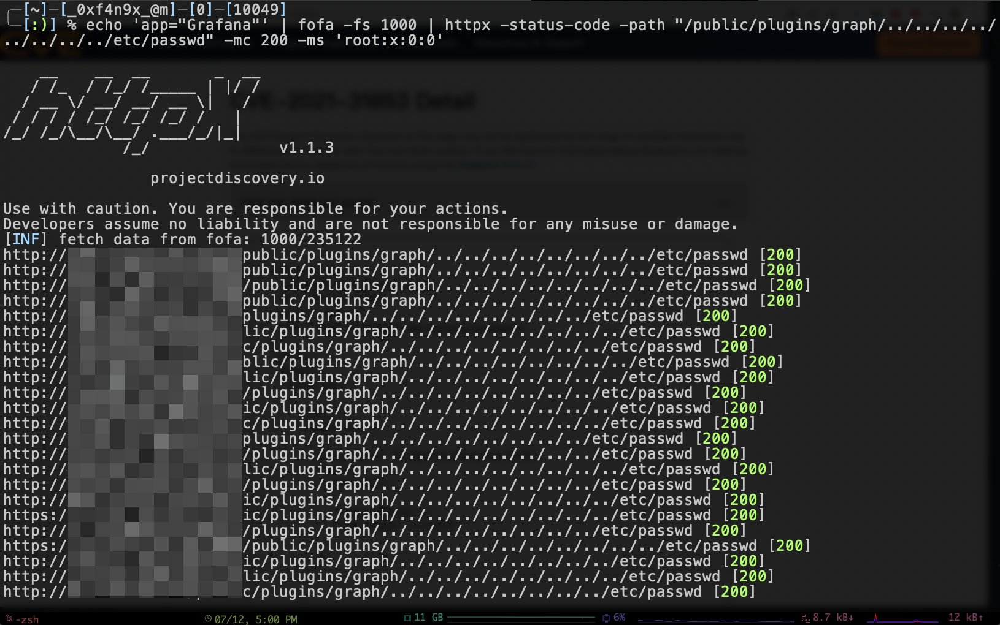

# FoFax

## 简介

FoFax是一款命令行fofa查询工具，简单就是最好的！

## 下载

点击 [Releases下载链接](https://github.com/xiecat/fofax/releases) ，按照自己的系统来选择相应的发行版本。

## 使用


```text

FoFax is a fast

Usage:
  ./fofax [flags]

Flags:
配置项:
   -email, -fofa-email string  Fofa API Email (default "xxxxxx@qq.com")
   -key, -fofakey string       Fofa API Key (default "dfc28xxxxxxxxxxxxxxxxxxxxf86a3c")
   -p, -proxy string           proxy for http like http://127.0.0.1:8080
   -fofa-url string            Fofa url (default "https://fofa.so")
   -debug                      开启 debug 模式

过滤项:
   -fs, -fetch-size int           最大查询数,默认 100 (default 100)
   -e, -exclude                   排除干扰
   -ec, -exclude-country          过滤 CN
   -ffi, -fetch-fullHost-info     提取完整的 hostinfo,带有 protocol
   -fto, -fetch-titles-ofDomain   提取指定根域名的 title
   -fof, -fetch-one-field string  填写需要的另一个字段如，port

单个 QUERY/CERT/ICON 搜索项:
   -q, -query string              FoFa 查询语句
   -uc, -url-cert string          输入 url(https) 查询证书
   -ui, -url-to-icon-hash string  通过 URL，计算 icon hash 后进行查询
   -if, -icon-file-path string    通过 ico 文件，计算 icon hash 后进行查询

多个 QUERY/CERT/ICON 搜索项:
   -qf, -query-file string           加载文件，查询多个语句
   -ucf, -url-cert-file string       读取文件中的URL，计算 cert 后进行查询
   -iuf, -icon-hash-url-file string  读取文件中的URL，计算 icon hash 后进行查询

OTHER OPTIONS:
   -version  Show version of fofadump

```

## 联动案例

### fofax && httpx

CVE-2021-43798 Grafana未授权目录遍历（fofax是开源后的名字，此前还没有一个正式的名字，下图中就叫fofa）。



### fofax && nuclei
