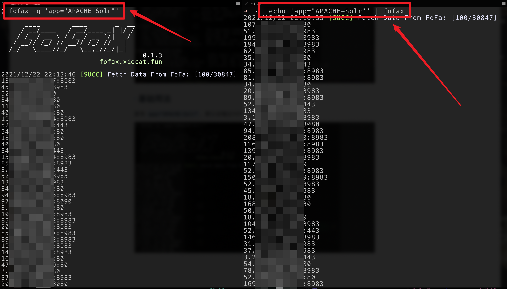

# fofaX

[](https://github.com/xiecat/fofax/releases/latest)[](https://github.com/xiecat/fofax/issues)[](https://twitter.com/_0xf4n9x_)

## 0x00 简介

fofaX是一款命令行fofa查询工具，定位命令行，简单就是最好的！

## 0x01 下载

点击 [Releases下载链接](https://github.com/xiecat/fofax/releases) ，按照自己的系统来选择相应的发行版本。

## 0x02 配置

### Windows


### macOS/Linux


## 0x03 使用

可以使用 `fofax -h` 显示帮助信息。


### 基础查询

有如下两种方式查询 `app="APACHE-Solr"`，不指定数量默认会输出100个host，并且默认会对数据进行去重。

```bash
fofax -q 'app="APACHE-Solr"'
```

```bash
echo 'app="APACHE-Solr"' | fofax
```



### 指定数量查询


### 用法


## 0x04 联动使用案例

### fofax && httpx

CVE-2021-43798 Grafana未授权目录遍历（fofax是开源后的名字，此前还没有一个正式的名字，下图中就叫fofa）。


### fofax && nuclei
